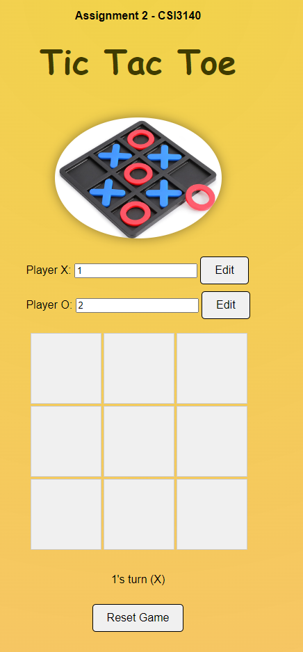
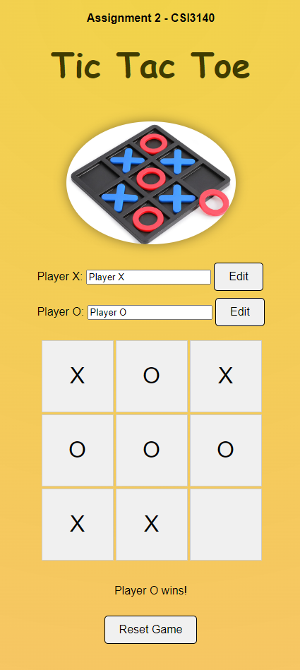
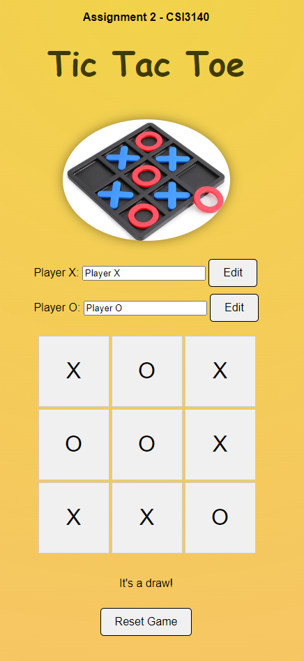

# Assignment 2 - Tic Tac Toe

We have created a basic Tic Tac Toe game utilizing html/css/js. Some of the features we have included to make the game seamless include:

- Player X and Player O rename features
- Reset button to start a new game
- Automatic winner determination and display

The first picture shows the initial state of the game with both player's names changed. You can see that even with renamed players, the console uses the correct names.

The next picture shows the game after Player O has won. The game automatically determines the winner and displays it on the screen.

The final picture shows the game after moves have been made and the game results in a draw. 

The game's logic is implemented in the a2.js file in which we have created a data structure that represents all of the winning combinations using 3 number lists that represent an index of 0-8. We then check if any of the winning combinations are present in the current game state. If they are, we display the winner. If there are no winning combinations and the game board is full, we display a draw.